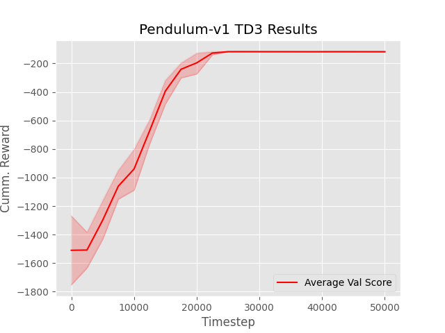
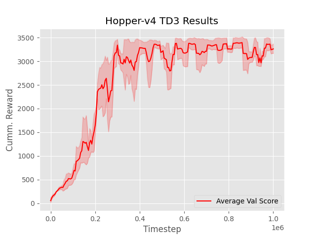
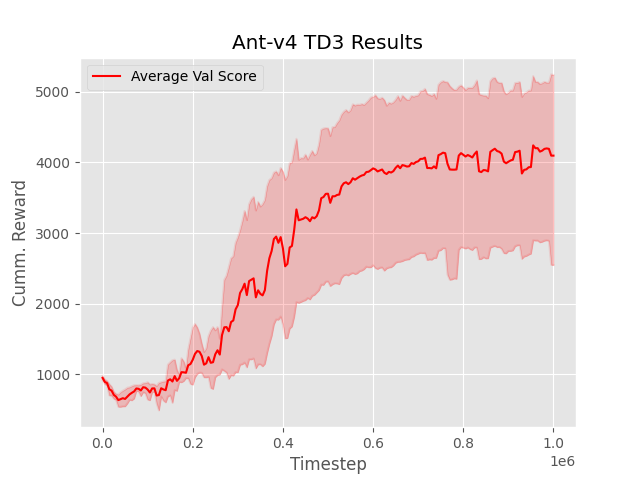

# Implemenation of the TD3 algorithm
--------------------

Implementation of the TD3 algorithm by Fujimoto et al. To run the repo install `uv` or use the `requirements.txt` file. 

```bash 
uv sync pip 
```

To train an agent run 
```bash 
python3 src/td3/main.py [ARGS]
```

To test an agent from the `models` directory 
```bash 
python3 src/td3/test.py --file [FILEDIR] --env [ENV] [ARGS]
```

----------------------
### Examples

Each game was tested on 3 seeds (0, 1, 2). 

| Game | Learning Curve             |  Video Example |
:------------------:| :-------------------------:|:-------------------------:
**Pendulum-v1** |  |  
**Hopper-v4** |  |  
**Ant-v4** |  |  

--------------
### References

[1] Fujimoto, S., van Hoof, H., & Meger, D. (2018). Addressing function approximation error in actor-critic methods. arXiv. https://arxiv.org/abs/1802.09477